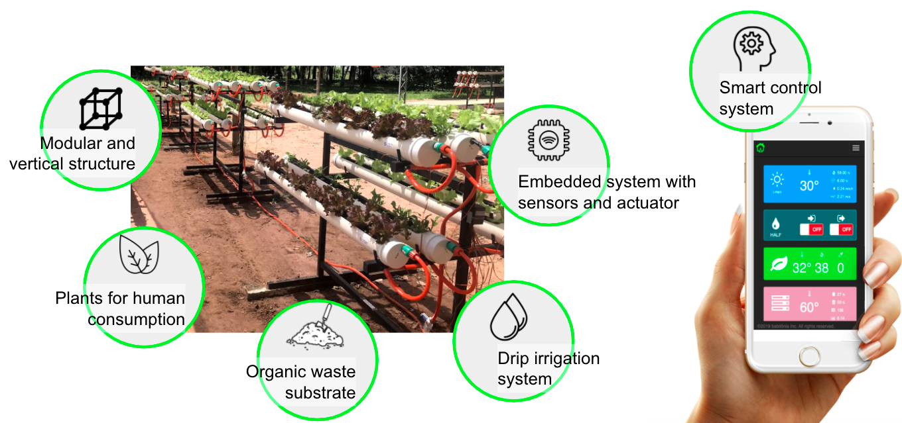
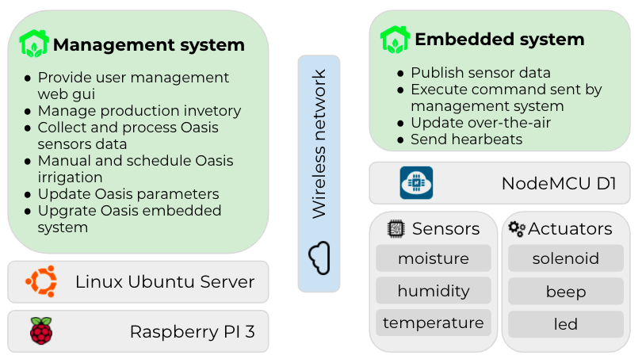

# Platform for Sustainable Urban Agriculture

## Context
Currently, food travels long distances from the regions where they are produced, processed to final consumers - "Food Miles" is the term coined by Tim Lang in the early 1990s referring to this distance. Along the way, costs and waste as well as environmental impacts are considerably high. Most consumers are in the urban centres, and today, no city survives on its own with regard to food. In addition, the stock of food within the cities does not exceed three days ("There are only nine meals between mankind and anarchy." Alfred Henry, 1906). The "truckers' strike" that occurred at the end of the first half of 2018 evidenced food insecurity in Brazilian cities and pointed out that price and availability of food in cities is linked to fossil fuel. The strike affected the distribution of food, caused the increase in prices and generated moments of panic in the population.

The research project consists of developing a platform for vegetables production in urban spaces capable of providing a continuous, automatic and abundant, fresh food for human consumption. The drivers for platform development are the concepts of vertical farms, sustainability and the internet of things. The platform is technologically feasible, recycles the organic wastes, reduces the environmental impacts caused by burning fossil fuel and other food logistics losses and will provide food security in urban centres.

## The automation technology

